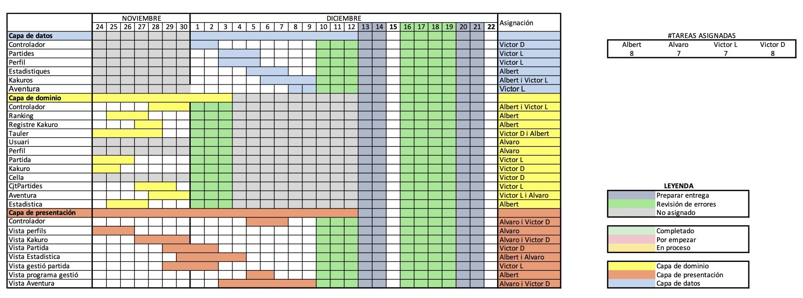

# PROP - Grup 14 - Subgrup 2
Versió 1.0

## Integrants del grup
* Ariño Cabau, Alvaro
* Bertran Serrano, Albert
* Delgado Padilla, Victor Manuel
* Latorre López, Victor

### Mails del grup
* [alvaro.arino@estudiantat.upc.edu](mailto::alvaro.arino@estudiantat.upc.edu)
* [albert.bertran.serrano@estudiantat.upc.edu](mailto::albert.bertran.serrano@estudiantat.upc.edu)
* [victor.delgado@estudiantat.upc.edu](mailto::victor.delgado@estudiantat.upc.edu)
* [victor.latorre@estudiantat.upc.edu](mailto::victor.latorre@estudiantat.upc.edu)

## Distribució dels directoris del projecte

Cada directori princiapl conté un index.html amb diferents explicacions.

Relació principal de directoris

*   FONTS - Arxius font del projecte
*   DOCS - Documentació del projecte
*   EXE - Executables
*   Altres
    *   style: Per guardar els estils dels HTML
    *   lib: conté les llibreries externes usades per programa
    *   files: conté arxius necesaris pel arxius Markdown i HTML

## Llibreries externes utilitzades
Per administrar totes les dependencies del projecte hem fet ús del Gradle.

Per acabar de completar la funcionalitat del nostre programa hem fet ús de diferents llibreries que ens podien facilitar la feina
alhora que aconseguiem funcionalitats mès completes.
### [JavaFX](http://openjfx.io)
Per aconseguir una interfaç gràfica mès rica, fem ús de les capacitats gràfiques que JavaFX aporta.
### [Gson](https://github.com/google/gson)
Per guardar d'una forma estructurada y ordenada les dades, fem ús d'archius JSON i per codificar i 
descodificar fem ús d'aquesta clase
> Gson is a Java library that can be used to convert Java Objects into their JSON representation. It can also be used to convert a JSON string to an equivalent Java object. 

## Distribució de la feina
